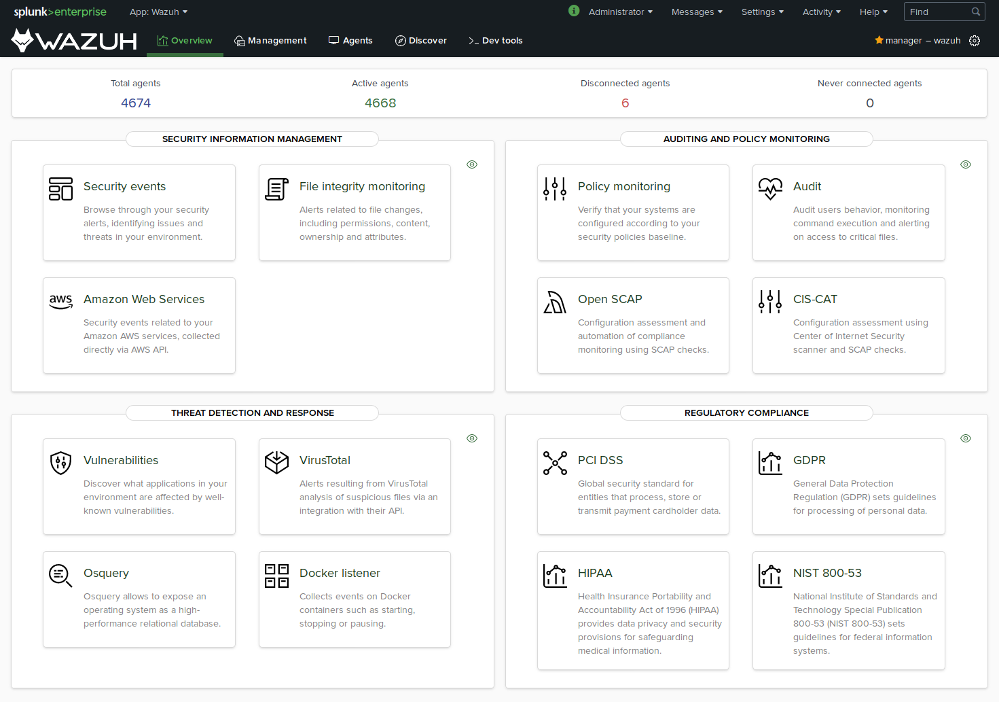

# Splunk app for Wazuh

 Wazuh app for Splunk offers an option to visualize _Wazuh Alerts_ and _API data_. Wazuh helps you to gain deeper security visibility into your infrastructure by monitoring hosts at an operating system and application level.
* * *

### Documentation

- [Wazuh app for Splunk installation guide](https://documentation.wazuh.com/current/installation-guide/installing-splunk/index.html)

## Branches

- `stable` branch on correspond to the last Wazuh app stable version.
- `master` branch contains the latest code, be aware of possible bugs on this branch.

### Requisites
1. An already installed Wazuh Manager with access to the API.
2. __Splunk Universal Forwarder__ where Wazuh Manager is installed.
3. At least one __Splunk Enterprise indexer__.

## Installation

| Splunk version | Wazuh version     | Installation                                                   |
| :------------: | :---------------: | :--------------------------------------------------------------|
|      7.0.3     |       3.2.1       | <https://packages.wazuh.com/3.x/splunkapp/v3.2.1_7.0.3.tar.gz> |
|      7.1.1     |       3.2.2       | <https://packages.wazuh.com/3.x/splunkapp/v3.2.2_7.1.1.tar.gz> |
|      7.1.1     |       3.2.3       | <https://packages.wazuh.com/3.x/splunkapp/v3.2.3_7.1.1.tar.gz> |
|      7.1.1     |       3.2.4       | <https://packages.wazuh.com/3.x/splunkapp/v3.2.4_7.1.1.tar.gz> |
|      7.1.1     |       3.3.0       | <https://packages.wazuh.com/3.x/splunkapp/v3.3.0_7.1.1.tar.gz> |
|      7.1.1     |       3.3.1       | <https://packages.wazuh.com/3.x/splunkapp/v3.3.1_7.1.1.tar.gz> |
|      7.1.2     |       3.4.0       | <https://packages.wazuh.com/3.x/splunkapp/v3.4.0_7.1.2.tar.gz> |
|      7.1.2     |       3.5.0       | <https://packages.wazuh.com/3.x/splunkapp/v3.5.0_7.1.2.tar.gz> |
|      7.1.2     |       3.6.0       | <https://packages.wazuh.com/3.x/splunkapp/v3.6.0_7.1.2.tar.gz> |
|      7.1.3     |       3.6.1       | <https://packages.wazuh.com/3.x/splunkapp/v3.6.1_7.1.3.tar.gz> |
|      7.2.0     |       3.7.0       | <https://packages.wazuh.com/3.x/splunkapp/v3.7.0_7.2.0.tar.gz> |
|      7.2.1     |       3.7.0       | <https://packages.wazuh.com/3.x/splunkapp/v3.7.0_7.2.1.tar.gz> |
|      7.2.1     |       3.7.1       | <https://packages.wazuh.com/3.x/splunkapp/v3.7.1_7.2.1.tar.gz> |
|      7.2.1     |       3.7.2       | <https://packages.wazuh.com/3.x/splunkapp/v3.7.2_7.2.1.tar.gz> |
|      7.2.3     |       3.8.0       | <https://packages.wazuh.com/3.x/splunkapp/v3.8.0_7.2.3.tar.gz> |
|      7.2.3     |       3.8.1       | <https://packages.wazuh.com/3.x/splunkapp/v3.8.1_7.2.3.tar.gz> |
|      7.2.3     |       3.8.2       | <https://packages.wazuh.com/3.x/splunkapp/v3.8.2_7.2.3.tar.gz> |
|      7.2.4     |       3.8.2       | <https://packages.wazuh.com/3.x/splunkapp/v3.8.2_7.2.4.tar.gz> |
|      7.2.5     |       3.8.2       | <https://packages.wazuh.com/3.x/splunkapp/v3.8.2_7.2.5.tar.gz> |
|      7.2.6     |       3.8.2       | <https://packages.wazuh.com/3.x/splunkapp/v3.8.2_7.2.6.tar.gz> |
|      7.2.6     |       3.9.0       | <https://packages.wazuh.com/3.x/splunkapp/v3.9.0_7.2.6.tar.gz> |
|      7.2.6     |       3.9.1       | <https://packages.wazuh.com/3.x/splunkapp/v3.9.1_7.2.6.tar.gz> |
|      7.3.0     |       3.9.1       | <https://packages.wazuh.com/3.x/splunkapp/v3.9.1_7.3.0.tar.gz> |
|      7.3.0     |       3.9.2       | <https://packages.wazuh.com/3.x/splunkapp/v3.9.2_7.3.0.tar.gz> |
|      7.3.0     |       3.9.3       | <https://packages.wazuh.com/3.x/splunkapp/v3.9.3_7.3.0.tar.gz> |
|      7.3.0     |       3.9.4       | <https://packages.wazuh.com/3.x/splunkapp/v3.9.4_7.3.0.tar.gz> |
|      7.3.0     |       3.9.5       | <https://packages.wazuh.com/3.x/splunkapp/v3.9.5_7.3.0.tar.gz> |
|      7.3.0     |       3.10.0      | <https://packages.wazuh.com/3.x/splunkapp/v3.10.0_7.3.0.tar.gz> |
|      7.3.0     |       3.10.1      | <https://packages.wazuh.com/3.x/splunkapp/v3.10.1_7.3.0.tar.gz> |
|      7.3.0     |       3.10.2      | <https://packages.wazuh.com/3.x/splunkapp/v3.10.2_7.3.0.tar.gz> |
|      8.0.0     |       3.10.2      | <https://packages.wazuh.com/3.x/splunkapp/wazuhapp-splunk-3.10.2_8.0.0.tar.gz> |
|      7.3.2     |       3.11.0      | <https://packages.wazuh.com/3.x/splunkapp/wazuhapp-splunk-3.11.0_7.3.2.tar.gz> |
|      7.3.2     |       3.11.1      | <https://packages.wazuh.com/3.x/splunkapp/wazuhapp-splunk-3.11.1_7.3.2.tar.gz> |
|      7.3.4     |       3.11.2      | <https://packages.wazuh.com/3.x/splunkapp/wazuhapp-splunk-3.11.2_7.3.4.tar.gz> |
|      7.3.4     |       3.11.3      | <https://packages.wazuh.com/3.x/splunkapp/wazuhapp-splunk-3.11.3_7.3.4.tar.gz> |
|      7.3.4     |       3.11.4      | <https://packages.wazuh.com/3.x/splunkapp/wazuhapp-splunk-3.11.4_7.3.4.tar.gz> |
|      7.3.4     |       3.12.0      | <https://packages.wazuh.com/3.x/splunkapp/wazuhapp-splunk-3.12.0_7.3.4.tar.gz> |
|      7.3.4     |       3.12.1      | <https://packages.wazuh.com/3.x/splunkapp/wazuhapp-splunk-3.12.1_7.3.4.tar.gz> |
|      7.3.4     |       3.12.2      | <https://packages.wazuh.com/3.x/splunkapp/wazuhapp-splunk-3.12.2_7.3.4.tar.gz> |
|      7.3.4     |       3.12.3      | <https://packages.wazuh.com/3.x/splunkapp/wazuhapp-splunk-3.12.3_7.3.4.tar.gz> |
|      7.3.5     |       3.13.1      | <https://packages.wazuh.com/3.x/splunkapp/wazuhapp-splunk-3.13.1_7.3.5.tar.gz> |
|      8.0.0     |       3.11.0      | <https://packages.wazuh.com/3.x/splunkapp/wazuhapp-splunk-3.11.0_8.0.0.tar.gz> |
|      8.0.0     |       3.11.1      | <https://packages.wazuh.com/3.x/splunkapp/wazuhapp-splunk-3.11.1_8.0.0.tar.gz> |
|      8.0.1     |       3.11.2      | <https://packages.wazuh.com/3.x/splunkapp/wazuhapp-splunk-3.11.2_8.0.1.tar.gz> |
|      8.0.1     |       3.11.3      | <https://packages.wazuh.com/3.x/splunkapp/wazuhapp-splunk-3.11.3_8.0.1.tar.gz> |
|      8.0.1     |       3.11.4      | <https://packages.wazuh.com/3.x/splunkapp/wazuhapp-splunk-3.11.4_8.0.1.tar.gz> |
|      8.0.2     |       3.12.0      | <https://packages.wazuh.com/3.x/splunkapp/wazuhapp-splunk-3.12.0_8.0.2.tar.gz> |
|      8.0.2     |       3.12.1      | <https://packages.wazuh.com/3.x/splunkapp/wazuhapp-splunk-3.12.1_8.0.2.tar.gz> |
|      8.0.2     |       3.12.2      | <https://packages.wazuh.com/3.x/splunkapp/wazuhapp-splunk-3.12.2_8.0.2.tar.gz> |
|      8.0.2     |       3.12.3      | <https://packages.wazuh.com/3.x/splunkapp/wazuhapp-splunk-3.12.3_8.0.2.tar.gz> |
|      8.0.2     |       3.13.0      | <https://packages.wazuh.com/3.x/splunkapp/wazuhapp-splunk-3.13.0_8.0.2.tar.gz> |
|      8.0.4     |       3.13.1      | <https://packages.wazuh.com/3.x/splunkapp/wazuhapp-splunk-3.13.1_8.0.4.tar.gz> |
|      8.0.4     |       3.13.2      | <https://packages.wazuh.com/3.x/splunkapp/wazuhapp-splunk-3.13.2_8.0.4.tar.gz> |
|      8.0.4     |       3.13.4      | <https://packages.wazuh.com/3.x/splunkapp/wazuhapp-splunk-3.13.4_8.0.4.tar.gz> |
|      8.0.4     |       3.13.5      | <https://packages.wazuh.com/3.x/splunkapp/wazuhapp-splunk-3.13.5_8.0.4.tar.gz> |

## Upgrade

Remove the app using splunk plugin tool

    $SPLUNK_HOME/bin/splunk remove app SplunkAppForWazuh

Install the app

     $SPLUNK_HOME/bin/splunk install app <last package file>

## Contribute

If you want to contribute to our project please don't hesitate to send a pull request. You can also join our users [mailing list](https://groups.google.com/d/forum/wazuh), by sending an email to <mailto:wazuh+subscribe@googlegroups.com>, to ask questions and participate in discussions.

## Copyright & License

Copyright (C) 2015-2019 Wazuh, Inc.

This program is free software; you can redistribute it and/or modify it under the terms of the GNU General Public License as published by the Free Software Foundation; either version 2 of the License, or (at your option) any later version.

Find more information about this on the [LICENSE](LICENSE) file.

## References

-   [Wazuh website](https://wazuh.com)
-   [Wazuh documentation](https://documentation.wazuh.com)
-   [Splunk documentation](http://docs.splunk.com/Documentation)
