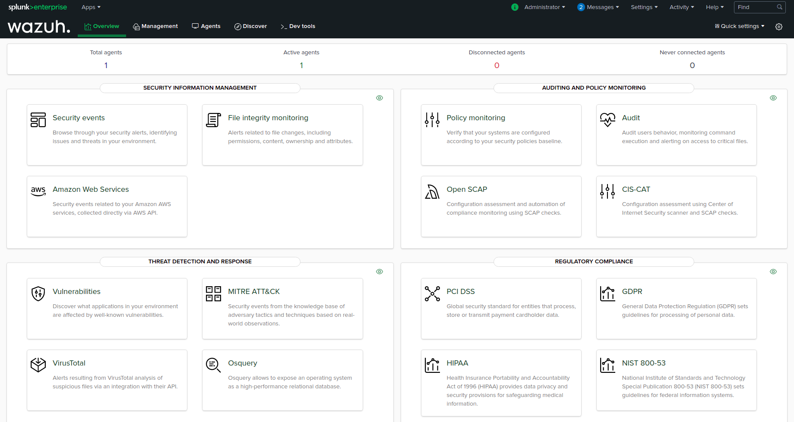

# Splunk app for Wazuh

 Wazuh app for Splunk offers an option to visualize _Wazuh Alerts_ and _API data_. Wazuh helps you to gain deeper security visibility into your infrastructure by monitoring hosts at an operating system and application level.
* * *

### Documentation

- [Wazuh app for Splunk installation guide](https://documentation.wazuh.com/current/installation-guide/installing-splunk/index.html)

## Branches

- `stable` branch on correspond to the last Wazuh app stable version.
- `master` branch contains the latest code, be aware of possible bugs on this branch.

### Requisites
1. An already installed Wazuh Manager with access to the API.
2. __Splunk Universal Forwarder__ where Wazuh Manager is installed.
3. At least one __Splunk Enterprise indexer__.

## Installation

### Compatibility Matrix

The compatibility matrix is avaliable in the repository [wiki](https://github.com/wazuh/wazuh-splunk/wiki/Compatibility).
## Upgrade

Remove the app using splunk plugin tool

    $SPLUNK_HOME/bin/splunk remove app SplunkAppForWazuh

Install the app

     $SPLUNK_HOME/bin/splunk install app <last package file>

## Contribute

If you want to contribute to our project please don't hesitate to send a pull request. You can also join our users [mailing list](https://groups.google.com/d/forum/wazuh), by sending an email to <mailto:wazuh+subscribe@googlegroups.com>, to ask questions and participate in discussions.

## Copyright & License

Copyright (C) 2015-2022 Wazuh, Inc.

This program is free software; you can redistribute it and/or modify it under the terms of the GNU General Public License as published by the Free Software Foundation; either version 2 of the License, or (at your option) any later version.

Find more information about this on the [LICENSE](LICENSE) file.

## References

-   [Wazuh website](https://wazuh.com)
-   [Wazuh documentation](https://documentation.wazuh.com)
-   [Splunk documentation](http://docs.splunk.com/Documentation)
